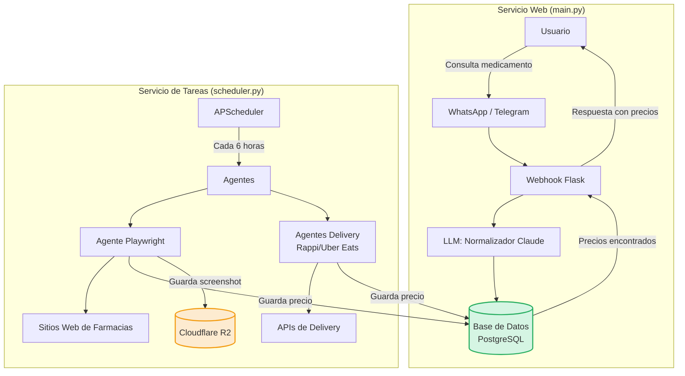

# 🤖 Dr. Ahorro Bot (Arquitectura de Producción)

> Bot conversacional multicanal para consultar información y precios públicos de medicamentos en México utilizando **Claude (Anthropic)** como motor de inteligencia artificial y **Web Scraping** para obtener precios reales desde farmacias con sitios web.

---

# 📌 Tabla de Contenidos

- [🚀 Características](#-características)
- [🛠️ Tecnologías](#️-tecnologías)
- [🧠 Arquitectura](#-arquitectura)
- [Componentes Principales](#componentes-principales)
- [📁 Estructura del Proyecto](#-estructura-del-proyecto)
- [💾 Base de Datos (Producción y Desarrollo)](#-base-de-datos-producción-y-desarrollo)
- [⏰ Tareas Programadas (Scheduler)](#-tareas-programadas-scheduler)
- [📋 Requisitos Previos](#-requisitos-previos)
- [⚙️ Instalación y Configuración](#️-instalación-y-configuración)
- [🚀 Uso](#-uso)
- [🔧 Variables de Entorno](#-variables-de-entorno)
- [🧪 Posibles Errores y Soluciones](#-posibles-errores-y-soluciones)
- [🚧 Mejoras Futuras](#-mejoras-futuras)
- [🙏 Créditos](#-créditos)
- [📜 Licencia](#-licencia)

---

# 🚀 Características

- ✅ **Arquitectura de Producción**: Desplegado en **Railway** con base de datos **PostgreSQL** y tareas programadas.
- ✅ **Recolección Automatizada**: Un **scheduler (`APScheduler`)** ejecuta agentes de scraping de forma periódica para mantener los precios actualizados.
- ✅ **Agentes de Scraping Avanzados**:
  - **Agente Playwright**: Extrae precios de farmacias con sitios web dinámicos (JavaScript).
  - **Agentes de Delivery**: Consulta precios en **Rappi** y **Uber Eats**.
  - **Scrapers Legacy**: Soporte para sitios estáticos con `requests` y `BeautifulSoup`.
- ✅ **Inteligencia Artificial**: Utiliza **Claude (Anthropic)** para normalizar los nombres de medicamentos ingresados por el usuario (ej. "Tempra" -> "Paracetamol").
- ✅ **Fallback Inteligente**: Si no se encuentran precios, el bot busca alternativas basadas en el principio activo, destaca si se requiere receta y puede responder preguntas de seguimiento básicas.
- ✅ Almacena el historial de precios en una base de datos **PostgreSQL** (producción) o **SQLite** (desarrollo).
- ✅ **Almacenamiento en la Nube**: Guarda capturas de pantalla de las búsquedas de Playwright en **Cloudflare R2** como evidencia.
- ✅ **Interfaz Multicanal**: Funciona tanto en **Telegram** como en **WhatsApp** (vía Twilio).
- ✅ Muestra un ranking de farmacias ordenado por precio.
- ✅ Si no existen precios disponibles, responde con la ficha del medicamento y continúa buscando información.
- ✅ Arquitectura modular y fácil de mantener.

---

# 🛠️ Tecnologías

| Tecnología | Uso |
|------------|-----|
| Python 3.10+ | Lenguaje principal |
| Flask | Webhook para WhatsApp |
| Twilio API | Integración con WhatsApp |
| python-telegram-bot | Bot de Telegram |
| Anthropic Claude | Procesamiento mediante IA |
| Requests | Solicitudes HTTP |
| BeautifulSoup4 | Extracción de información HTML |
| lxml | Parser HTML |
| python-dotenv | Variables de entorno |
| Playwright | Web Scraping de sitios dinámicos (JavaScript) |
| APScheduler | Automatización de tareas de scraping |
| PostgreSQL | Base de datos en producción |
| psycopg | Driver de PostgreSQL para Python |
| Cloudflare R2 | Almacenamiento de capturas de pantalla (screenshots) |
| SQLite | Base de datos para desarrollo local |
| ngrok | Exposición del servidor local |

---

# 🧠 Arquitectura

El sistema se divide en dos servicios principales que corren de forma independiente en producción (Railway):

1.  **Servicio Web (`main.py`)**: Una aplicación Flask que expone un webhook para recibir mensajes de WhatsApp y Telegram. Se encarga de procesar las consultas de los usuarios en tiempo real.
2.  **Servicio de Tareas (`scheduler.py`)**: Un proceso que ejecuta tareas de scraping de forma periódica para recolectar y actualizar los precios de los medicamentos en la base de datos.



---

# 🧠 Fallback Inteligente y Flujo Conversacional

Uno de los aprendizajes clave fue que un mensaje de "no encontramos precios" no es útil para el usuario. El bot debe ser proactivo, ofrecer alternativas y guiar al usuario.

### Antes (Respuesta poco útil)

```text
Aún no tenemos precios registrados
para ese medicamento en tu zona.
Estamos actualizando nuestra base
de datos — intenta de nuevo mañana.
```

### Después (Fallback Inteligente)

```text
💊 *Amoxicilina + Ácido Clavulánico*
⚠️ *Requiere receta médica*

Aún no tenemos precios en tu zona,
pero encontramos estos similares:

• Amoxicilina 500mg (genérico)
  → Farmacia Similares — $48.00
  → Farmacias del Ahorro — $62.00

¿Quieres buscar el precio exacto
de este medicamento? Escribe "sí"
y te avisamos cuando lo tengamos.
```

### Lógica Implementada

1.  **Búsqueda de Alternativas**: Cuando no hay precios para un medicamento, el bot busca en la base de datos otras presentaciones que contengan el mismo **principio activo**. Si encuentra resultados, los ofrece como "similares".
2.  **Información Crítica Primero**: Si el medicamento requiere receta, esta información se muestra al inicio del mensaje, en negrita y con un emoji de advertencia (⚠️) para máxima visibilidad.
3.  **Flujo de Dos Turnos**: El bot mantiene un contexto de la última búsqueda del usuario. Esto le permite responder preguntas de seguimiento como:
    -   `"sí"` / `"no"`: Para confirmar si desea ser notificado.
    -   `"¿hay genérico?"`: Para listar las alternativas encontradas.
    -   `"¿cuánto tarda?"`: Para dar una estimación del tiempo de actualización de precios.
4.  **Llamada a la Acción**: El mensaje de fallback siempre termina con una pregunta clara que guía al usuario sobre qué hacer a continuación, evitando callejones sin salida conversacionales.
```

---

# Componentes Principales

1.  **Handlers (`bot/`)**: Módulos que gestionan la comunicación específica para cada canal (Telegram, WhatsApp).
2.  **Normalizador (`llm/`)**: Usa Claude para interpretar el texto del usuario y extraer el nombre genérico del medicamento.
3.  **Base de Datos (`data/database.py`)**: Abstracción que se conecta a PostgreSQL en producción (`DATABASE_URL`) o a un archivo SQLite local para desarrollo.
4.  **Scheduler (`scheduler.py`)**: Orquesta la ejecución periódica de los agentes de scraping.
5.  **Agentes (`data/agents/`)**:
    -   `playwright_agent.py`: Navega sitios de farmacias que requieren JavaScript, toma capturas de pantalla y extrae precios.
    -   `rappi_agent.py` / `ubereats_agent.py`: Simulan la interacción con las plataformas de delivery para obtener precios.

---

# 📁 Estructura del Proyecto

```text
dr-ahorro/
│
├── bot/
│   ├── __init__.py
│   ├── counter.py
│   ├── telegram_notifier.py
│   ├── telegram_handler.py
│   └── whatsapp_handler.py
│
│   ├── __init__.py
│   ├── database.py
│   ├── agents/
│   │   ├── __init__.py
│   │   ├── rappi_agent.py
│   │   └── ubereats_agent.py
│   ├── auth/
│   │   ├── cookies_rappi.json
│   │   └── cookies_ubereats.json
│   ├── ocr/
│   │   ├── claude_extractor.py
│   │   └── tesseract_extractor.py
│   └── scrapers/
│       ├── web_scraper.py
│   └── imagenes_prueba/
│       └── farmacia_1.jpg
│
├── llm/
│   ├── __init__.py
│   └── normalizer.py
│
├── screenshots/
│   └── ... (capturas de Playwright)
├── .env
├── .env.example
├── data/
│   ├── migrate.py
│   └── precios.db (local)
├── .gitignore
├── hallazgos_playwright.md
├── main.py
├── scheduler.py
├── requirements.txt
└── README.md
```

---

# 📋 Requisitos Previos

Antes de ejecutar el proyecto necesitas:

- Python 3.14 o superior
- Cuenta de Anthropic
- Cuenta de Twilio
- Bot creado mediante BotFather
- ngrok instalado

---

# ⚙️ Instalación y Configuración

## 1. Clonar el repositorio

```bash
git clone https://github.com/tu_usuario/dr-ahorro-bot.git

cd dr-ahorro-bot
```

---

## 2. Crear un entorno virtual

### Windows

```cmd
python -m venv venv

venv\Scripts\activate
```

### Linux / macOS

```bash
python3 -m venv venv

source venv/bin/activate
```

---

## 3. Instalar dependencias

```bash
pip install -r requirements.txt
```

---

## 4. Configurar variables de entorno

Copiar el archivo:

```bash
cp .env.example .env
```

Completar las credenciales:

```env
# Telegram
TELEGRAM_BOT_TOKEN=

# Claude
ANTHROPIC_API_KEY=

# Twilio
TWILIO_ACCOUNT_SID=
TWILIO_AUTH_TOKEN=
TWILIO_WHATSAPP_NUMBER=

# Webhook
WEBHOOK_URL=https://xxxxx.ngrok-free.app/webhook

PORT=5000
```

---

## 5. Ejecutar ngrok

```bash
ngrok http 5000
```

Actualizar la URL pública en:

```env
WEBHOOK_URL=https://tu-url.ngrok-free.app/webhook
```

---

# 🚀 Uso

## Ejecutar únicamente Telegram

```bash
python main.py --channel telegram
```

---

## Ejecutar únicamente WhatsApp

```bash
python main.py --channel whatsapp --port 5000
```

---

## Ejecutar ambos canales

```bash
python main.py --channel all
```

---

# 🌐 Web Scraping de Farmacias

El proyecto incorpora un módulo de Web Scraping encargado de consultar precios públicos de medicamentos disponibles en farmacias mexicanas.

## Objetivo

Obtener precios reales para complementar la información proporcionada por el bot utilizando únicamente información pública.

---

## Estrategia de obtención de precios

El proyecto sigue una estrategia híbrida.

### 1. Web Scraping

Se consulta el HTML público del sitio web mediante:

- Requests
- BeautifulSoup4
- Selectores CSS
- Parser lxml

Cuando el precio aparece directamente en el código fuente (Ctrl+U), puede extraerse mediante scraping tradicional.

---

### 2. OCR

Muchas farmacias muestran el precio únicamente dentro de imágenes o contenido generado dinámicamente mediante JavaScript.

En esos casos el proyecto utiliza OCR para extraer automáticamente el precio desde capturas de pantalla.

Esta estrategia permite cubrir una mayor cantidad del mercado mexicano.

---

## Diagnóstico previo

Antes de desarrollar un scraper se realiza un diagnóstico del sitio web.

1. Abrir la página del medicamento.
2. Presionar **Ctrl + U** para visualizar el código fuente.
3. Buscar el precio.

Si el precio aparece en el código fuente:

✅ Se utiliza BeautifulSoup.

Si el precio no aparece:

➡️ Se documenta el caso para utilizar OCR.

---

## Cobertura

Actualmente el proyecto considera dos grupos principales:

- Farmacias con precios públicos accesibles mediante HTML.
- Farmacias cuyos precios requieren OCR.

La combinación de ambas técnicas permite ampliar significativamente la cobertura de medicamentos.

---

## Ejecutar el scraper

```bash
python data/scrapers/web_scraper.py
```

---

## Resultado

Los datos obtenidos se almacenan automáticamente en:

```text
data/scrapers/resultados_farmacias.json
```

Ejemplo:

```json
{
  "medicamento_buscado": "Paracetamol",
  "nombre_encontrado": "Paracetamol 500 mg",
  "farmacia": "Farmacia de ejemplo",
  "precio": 49.50,
  "precio_promedio": 38.00,
  "vigencia_precio": "2026-07-15",
  "url_producto": "https://...",
  "fuente": "scrape_web",
  "fecha_consulta": "2026-07-07T10:30:00"
}
```

---
# 📄 Hallazgos Técnicos

Durante el desarrollo se documentan las pruebas realizadas sobre diferentes farmacias mexicanas.

Toda la información se registra en:

```text
hallazgos_scraping.md
```

Cada análisis incluye:

- Nombre de la farmacia.
- URL analizada.
- Disponibilidad del precio.
- Resultado de Ctrl+U.
- Si el sitio utiliza JavaScript.
- Posibilidad de realizar Web Scraping.
- Necesidad de OCR.
- Observaciones técnicas.
- Estado del scraper.
---

# 🔧 Variables de Entorno

| Variable | Descripción | Obligatoria |
|-----------|-------------|-------------|
| TELEGRAM_BOT_TOKEN | Token del bot de Telegram | ✅ |
| ANTHROPIC_API_KEY | API Key de Claude | ✅ |
| TWILIO_ACCOUNT_SID | Cuenta de Twilio | WhatsApp |
| TWILIO_AUTH_TOKEN | Token de Twilio | WhatsApp |
| TWILIO_WHATSAPP_NUMBER | Número Sandbox | WhatsApp |
| WEBHOOK_URL | URL pública de ngrok | WhatsApp |
| PORT | Puerto de Flask | No |

---
## Límites de API

### Twilio Sandbox (WhatsApp)
- **Límite:** 50 conversaciones por día por número de teléfono (sandbox).
- **Recomendación:** Monitorear el uso y considerar migrar a producción antes de superar el límite.

### Anthropic Claude API
- **Límite:** Depende del plan. Para el plan gratuito: 50 requests por minuto o 100,000 tokens por minuto (según el modelo).
- **Manejo de error 429:** El bot responde con "Alcanzamos el límite de consultas por hoy. Vuelve mañana."

---
## Notificaciones por Telegram (límite diario)

El bot de WhatsApp lleva un contador de mensajes procesados por día. Cuando se alcanza el **80% del límite diario del sandbox de Twilio** (40 de 50 conversaciones), envía una alerta al administrador por Telegram.

Para habilitarlo, define en `.env`:
- `TELEGRAM_BOT_TOKEN`: token de tu bot de Telegram (ya lo tienes).
- `TELEGRAM_CHAT_ID`: ID del chat del administrador (obtenido con @userinfobot).

Si no se configuran, la notificación simplemente se omite.

---

# 🧪 Posibles Errores y Soluciones

| Error | Solución |
|--------|----------|
| ModuleNotFoundError | Ejecutar `pip install -r requirements.txt` |
| Error 404 en Telegram | Verificar el Token del bot |
| Webhook no registrado | Revisar la URL pública de ngrok |
| Claude no responde | Verificar la API Key |
| WhatsApp no responde | Revisar Twilio y el webhook |
| Error durante el scraping | Verificar la estructura HTML del sitio o actualizar los selectores CSS |

---

# 🚧 Mejoras Futuras

- Consultar múltiples farmacias automáticamente.
- Automatizar el flujo OCR para farmacias sin HTML público.
- Detectar automáticamente cuándo utilizar Scraping u OCR.
- Calcular precios promedio entre múltiples farmacias.
- Implementar caché para reducir consultas repetidas.
- Exponer una API REST para consultar medicamentos y precios.

---

# 🙏 Créditos

Proyecto desarrollado para practicar:

- Arquitectura de software en Python.
- Bots conversacionales.
- Integración con Telegram.
- Integración con WhatsApp mediante Twilio.
- Webhooks con Flask.
- Consumo de APIs.
- Modelos LLM con Anthropic Claude.
- Técnicas de Web Scraping con Requests y BeautifulSoup.

---

# 📜 Licencia

Este proyecto es de código abierto y puede ser utilizado como referencia.

---

⭐ Si este proyecto te resulta útil, considera darle una estrella al repositorio.
