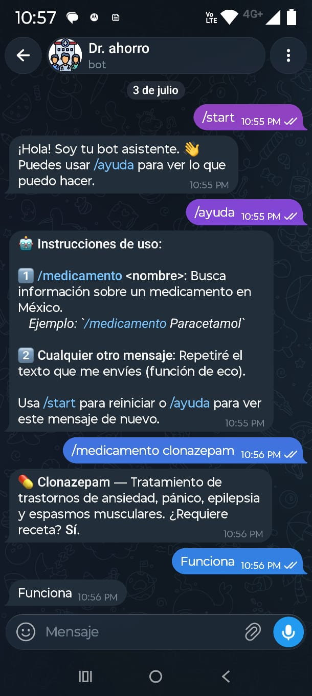

# 🚀 Dr. Ahorro Bot - WhatsApp con Twilio y OCR

Proyecto para crear un bot de WhatsApp capaz de analizar promociones de farmacias a partir de imágenes.

## 📋 Descripción
Este proyecto consiste en un bot de WhatsApp que utiliza **Twilio** para la mensajería, **Flask** como servidor web y **Tesseract OCR** para extraer texto de imágenes. El objetivo es poder enviar una foto de una promoción de farmacia y obtener un análisis de la misma utilizando la IA de **Anthropic (Claude)**.

La aplicación se prueba localmente exponiendo el servidor Flask a internet mediante **ngrok**.

---

# 🛠️ Tecnologías utilizadas

- Python 3.10 o superior
- Flask
- Twilio
- Tesseract OCR
- Anthropic API
- python-dotenv
- Ngrok
- Git
- GitHub

---

# 📁 Estructura del proyecto

```sh
dr-ahorro-bot/
│── main.py
│── requirements.txt # Contiene flask, twilio, etc.
│── README.md
│── .gitignore
│── .env.example
```

---

# ⚙️ Requisitos

Antes de comenzar es necesario tener instalado:

- Python 3.10 o superior
- pip
- Git
- Tesseract OCR
- Ngrok

Opcional:

- Railway CLI

---
# 🔄 Funcionamiento
El bot utiliza un webhook para recibir los mensajes enviados a través del Sandbox de Twilio para WhatsApp.

1. Un usuario envía un mensaje de texto o una imagen al número de WhatsApp del Sandbox de Twilio.
2. Twilio reenvía el mensaje a una URL pública (generada por **ngrok**) que apunta a nuestro servidor local.
3. La aplicación **Flask** en `main.py` recibe la petición en el endpoint `/webhook`.
4. Si el mensaje es una imagen, se utiliza **Tesseract OCR** para extraer el texto.
5. El texto (ya sea del mensaje original o extraído de la imagen) se envía a la API de **Anthropic** para su análisis.
6. La respuesta generada por la IA se formatea y se envía de vuelta al usuario a través de Twilio.

---
# 💻 Ejecutar el proyecto localmente

## 1. Clonar el repositorio

> **Nota:** Este proyecto debe estar en un repositorio privado llamado `dr-ahorro-bot`.

```bash
# Reemplaza la URL con la de tu nuevo repositorio privado
git clone https://github.com/tu-usuario/dr-ahorro-bot.git
```

Entrar al proyecto

```bash
cd Deployment-Real-Railway
```

---

## 2. Crear un entorno virtual

Windows

```bash
python -m venv venv
venv\Scripts\activate
```

Linux / macOS

```bash
python3 -m venv venv
source venv/bin/activate
```

---

## 3. Instalar dependencias

```bash
pip install -r requirements.txt
```

---

## 4. Configurar las variables de entorno

| Variable | Descripción |
|----------|-------------|
| `TELEGRAM_TOKEN` | Token del bot generado con BotFather. |
| `ANTHROPIC_API_KEY` | API Key de Anthropic. |
| `WEBHOOK_URL` | URL pública generada por Railway. |
| `PORT` | Puerto asignado automáticamente por Railway. |

Ejemplo de archivo `.env`:

```env
TELEGRAM_TOKEN=xxxxxxxxxxxxxxxx
ANTHROPIC_API_KEY=sk-ant-xxxxxxxxxxxxxxxx
WEBHOOK_URL=https://deployment-real-railway-production.up.railway.app
PORT=8080
```
---

## 5. Ejecutar la aplicación

```bash
python main.py
```

---

# ☁️ Deploy en Railway

## Opción 1 (Recomendada): Desde GitHub

1. Crear una cuenta en Railway.
2. Iniciar sesión con GitHub.
3. Seleccionar **New Project**.
4. Elegir **Deploy from GitHub Repo**.
5. Seleccionar este repositorio.
6. Railway detectará automáticamente el proyecto.
7. Configurar las variables de entorno necesarias.
8. Esperar a que termine el Build.
9. Abrir la URL generada por Railway.

Railway realizará nuevos despliegues automáticamente cada vez que se haga un **push** a la rama conectada, si el autodeploy está habilitado. 

---

## Opción 2: Utilizando Railway CLI

Instalar Railway CLI

```bash
npm install -g @railway/cli
```

Iniciar sesión

```bash
railway login
```

Inicializar el proyecto

```bash
railway init
```

Desplegar

```bash
railway up
```

Este comando sube el proyecto, construye la aplicación y realiza el despliegue automáticamente. 

---

# 🌐 URL del proyecto desplegado

<https://deployment-real-railway-production.up.railway.app>

> **Nota**
>
> Al acceder desde un navegador a la URL de Railway es normal obtener un **404 Not Found**.
>
> Esto se debe a que el proyecto corresponde a un bot de Telegram y únicamente expone el endpoint `/webhook`, utilizado por Telegram para enviar las actualizaciones del bot.
---
## 🤖 Comandos disponibles

- /start
- /ayuda
- /medicamento <nombre>

Ejemplo:

/medicamento Paracetamol

# 📦 Dependencias

Todas las dependencias se encuentran en:

```
requirements.txt
```

Para instalarlas:

```bash
pip install -r requirements.txt
```

---
## ✅ Prueba de funcionamiento

Para comprobar que el despliegue fue exitoso:

1. Buscar el bot en Telegram.
2. Enviar el mensaje:

```text
funciona
```

3. El bot responderá:

```text
funciona
```

Esta prueba verifica que el webhook está correctamente configurado y que Railway recibe y procesa las solicitudes enviadas por Telegram.
---
## 📷 Evidencia

Prueba de funcionamiento del bot desde una cuenta diferente a la de desarrollo.



# 👩‍💻 Autor

**Annet Martínez**

Ingeniería en Tecnologías de la Información y Comunicaciones

GitHub: <https://github.com/annetjmtze>

Repositorio:
<https://github.com/annetjmtze/Deployment-Real-Railway>

Proyecto desplegado:
<https://deployment-real-railway-production.up.railway.app>

---